Modelling for Scotland
================
Julian Faraway
2022-01-06

-   [Setup](#setup)
-   [Data](#data)
-   [Comparison to Infection Survey](#comparison-to-infection-survey)
-   [Glasgow only](#glasgow-only)
-   [Level of Aggregation](#level-of-aggregation)
-   [Relationships across Scotland](#relationships-across-scotland)
-   [Varying Coefficient models](#varying-coefficient-models)
-   [Lagged Models for Prediction](#lagged-models-for-prediction)

# Setup

Set some graphics options. The here package ensures files are found in
the expected places.

``` r
library(svglite)
library(here)
library(tidyverse)
library(lubridate)
library(mgcv)
library(broom)
```

Load previously processed data

``` r
load(here("data/scot.rda"))
```

Restrict to one year

``` r
startdate = ymd("2020-09-01")
enddate = ymd("2021-08-31")

allscot %>% 
  filter(between(Date, startdate,enddate)) -> allscot
```

Merge in population data and create cases per 100,000 population
variable. Need to add +1 to deal with zeroes on log scale

``` r
left_join(allscot, scotpop, by = c("hab" = "HBName")) %>% 
  mutate(rollper = (rollcases+1)*1e5/hbpop) %>% 
  select(Date,hab,N1,cases,hbpop,rollper,rollcases) -> allscot
allhabs = unique(allscot$hab)
```

Glasgow as the reference level

``` r
allscot$hab = fct_relevel(allscot$hab,"Greater Glasgow and Clyde")
```

# Data

Some information about the data

Population and WWTP coverage fraction

``` r
scotpop %>% select(HBName,hbpop,wwpop,covfrac) %>% 
  knitr::kable(digits=2,
               col.names = c("Health Area", "Population",
                             "WWTP Population", "Fraction"))
```

| Health Area               | Population | WWTP Population | Fraction |
|:--------------------------|-----------:|----------------:|---------:|
| Ayrshire and Arran        |     367990 |          305559 |     0.83 |
| Borders                   |     115240 |           62498 |     0.54 |
| Dumfries and Galloway     |     148290 |           61560 |     0.42 |
| Forth Valley              |     305930 |          214959 |     0.70 |
| Grampian                  |     585550 |          372632 |     0.64 |
| Highland                  |     320860 |           98719 |     0.31 |
| Lothian                   |     912490 |          781775 |     0.86 |
| Orkney                    |      22400 |            7757 |     0.35 |
| Shetland                  |      22870 |            7843 |     0.34 |
| Western Isles             |      26500 |            7247 |     0.27 |
| Fife                      |     374130 |          305019 |     0.82 |
| Tayside                   |     416550 |          268994 |     0.65 |
| Greater Glasgow and Clyde |    1185240 |         1368617 |     1.15 |
| Lanarkshire               |     661960 |          304440 |     0.46 |

WWTP sites information

``` r
scotrna %>% 
  filter(between(Date, startdate,enddate)) %>% 
  group_by(hab) %>% 
  summarise(popsize = sum(as.numeric(unique(pop))),
            nobs = n(),
            nsites = length(unique(site))) %>% 
  knitr::kable(col.names = c("Health Area", "WW Population",
                             "WW observations", "Number of sites"))
```

| Health Area               | WW Population | WW observations | Number of sites |
|:--------------------------|--------------:|----------------:|----------------:|
| Ayrshire and Arran        |        305559 |             377 |               9 |
| Borders                   |         62498 |             364 |               9 |
| Dumfries and Galloway     |         61560 |             330 |               8 |
| Fife                      |        305019 |             635 |              12 |
| Forth Valley              |        214959 |             442 |               9 |
| Grampian                  |        372632 |             535 |              12 |
| Greater Glasgow and Clyde |       1368617 |             501 |               9 |
| Highland                  |         98719 |             342 |               6 |
| Lanarkshire               |        304440 |             603 |              17 |
| Lothian                   |        781775 |             610 |              12 |
| Orkney                    |          7757 |              99 |               1 |
| Shetland                  |          7843 |              67 |               1 |
| Tayside                   |        268994 |             216 |               4 |
| Western Isles             |          7247 |              33 |               1 |

# Comparison to Infection Survey

``` r
isd = read_csv(here(file.path("data","isd.csv")))
```

pick out and group PH data

``` r
scotcc %>% group_by(Date) %>% summarise(cases = sum(DailyPositive)) -> scc
```

compute weekly rolling sums

``` r
scc %>% mutate(wcases = zoo::rollsumr(scc$cases, k=7, fill="extend")) -> scc
```

join

``` r
left_join(isd, scc, by=c("end" = "Date")) -> phinf
```

``` r
ggplot(phinf, aes(x=end, y=wcases/ninf)) + geom_point() +
  geom_smooth(color='black') + 
  ylab("Ratio") + xlab("Date") + xlim(as_date(c("2020-10-31","2021-09-25")))
```

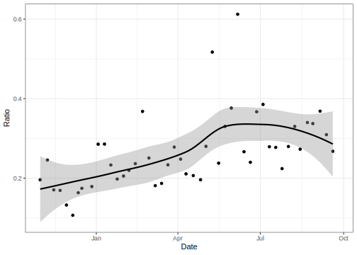<!-- -->

-   Ratio peaks around 0.35
-   Underreporting and shedding profiles mean ratio will not be 1
-   Ratio is increasing in time which has several possible explanations

# Glasgow only

Only consider Glasgow (highest population, most measurements)

``` r
allscot %>% 
  filter(hab == "Greater Glasgow and Clyde") -> glasgow
```

``` r
glasgow %>% 
  ggplot(aes(x=N1+20, y = rollper)) + 
  geom_point(size=0.5,alpha=0.25) +
  scale_x_continuous(name = "RNA gc/l", trans = "log10") +
  scale_y_continuous(name = "COVID-19 case rate", trans = "log10") +
  geom_smooth(method="lm", color='black')
```

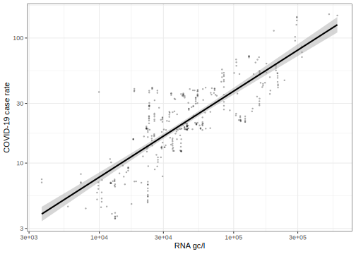<!-- -->

Looks fine on a log scale but now consider untransformed

``` r
glasgow %>% 
  ggplot(aes(x=N1+20, y = rollper)) + 
  geom_point(size=0.5,alpha=0.25) +
  scale_x_continuous(name = "RNA gc/l") +
  scale_y_continuous(name = "COVID-19 case rate") +
  geom_smooth(color='black') 
```

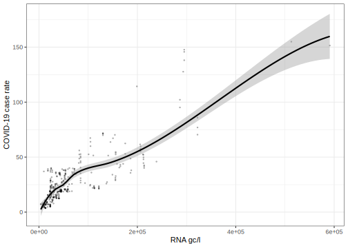<!-- -->

Can see non-linearity on the untransformed scale

Fit the a linear model with the variables on a log scale

``` r
glasmod = lm(log(rollper) ~ log(N1), glasgow)
summary(glasmod)
```


    Call:
    lm(formula = log(rollper) ~ log(N1), data = glasgow)

    Residuals:
       Min     1Q Median     3Q    Max 
    -1.039 -0.267 -0.073  0.326  1.571 

    Coefficients:
                Estimate Std. Error t value Pr(>|t|)
    (Intercept)  -4.2868     0.2790   -15.4   <2e-16
    log(N1)       0.6874     0.0261    26.4   <2e-16

    Residual standard error: 0.441 on 363 degrees of freedom
    Multiple R-squared:  0.657, Adjusted R-squared:  0.656 
    F-statistic:  695 on 1 and 363 DF,  p-value: <2e-16

# Level of Aggregation

Create a whole of Scotland dataset

``` r
left_join(allscot, scotpop, by = c("hab" = "HBName")) %>% 
  mutate(wbyn1 = N1*wwpop) %>% 
  group_by(Date) %>% 
  summarise(N1 = sum(wbyn1)/sum(scotpop$wwpop),
            cases = sum(rollper)*1e5/sum(scotpop$hbpop)) %>% 
  ungroup() -> aggscot
```

``` r
ggplot(aggscot,aes(N1, cases)) +
  geom_point(size=0.5,alpha=0.25) +
  scale_x_continuous(name = "RNA gc/l", trans = "log10") +
  scale_y_continuous(name = "COVID-19 case rate", trans = "log10") +
  geom_smooth(method="lm", color='black')    
```

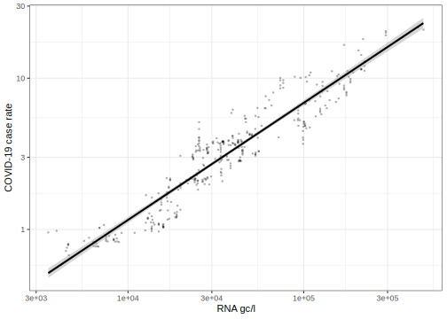<!-- -->

A stronger relationship is seen compared to the individual areas

Now fit a model

``` r
lmodagg = lm(log(cases) ~ log(N1), aggscot)
summary(lmodagg)
```


    Call:
    lm(formula = log(cases) ~ log(N1), data = aggscot)

    Residuals:
       Min     1Q Median     3Q    Max 
    -0.618 -0.186 -0.027  0.197  0.768 

    Coefficients:
                Estimate Std. Error t value Pr(>|t|)
    (Intercept)  -6.9881     0.1552   -45.0   <2e-16
    log(N1)       0.7744     0.0147    52.5   <2e-16

    Residual standard error: 0.266 on 363 degrees of freedom
    Multiple R-squared:  0.884, Adjusted R-squared:  0.883 
    F-statistic: 2.76e+03 on 1 and 363 DF,  p-value: <2e-16

``` r
exp(predict(lmodagg,data.frame(N1=mean(aggscot$N1)),interval = "prediction"))
```

         fit    lwr    upr
    1 4.4051 2.6097 7.4356

compared to a Glasgow only model

``` r
glasmod = lm(log(rollper) ~ log(N1), glasgow)
summary(glasmod)
```


    Call:
    lm(formula = log(rollper) ~ log(N1), data = glasgow)

    Residuals:
       Min     1Q Median     3Q    Max 
    -1.039 -0.267 -0.073  0.326  1.571 

    Coefficients:
                Estimate Std. Error t value Pr(>|t|)
    (Intercept)  -4.2868     0.2790   -15.4   <2e-16
    log(N1)       0.6874     0.0261    26.4   <2e-16

    Residual standard error: 0.441 on 363 degrees of freedom
    Multiple R-squared:  0.657, Adjusted R-squared:  0.656 
    F-statistic:  695 on 1 and 363 DF,  p-value: <2e-16

``` r
exp(predict(glasmod,data.frame(N1=mean(aggscot$N1)),interval = "prediction"))
```

        fit    lwr    upr
    1 25.34 10.624 60.437

# Relationships across Scotland

Four selected areas as seen in the paper

``` r
selset = c("Borders","Lothian","Lanarkshire","Orkney")
```

``` r
allscot %>% 
  filter(hab %in% selset) %>% 
  ggplot(aes(N1,rollper)) + geom_point(alpha=0.25,size=0.25) +
  ylab("COVID-19 case rate") + xlab("RNA gc/l") +
  facet_wrap(~ hab, scales = "free") +
  geom_smooth(se=FALSE,color='black') +
  scale_x_continuous(labels = scales::scientific)
```

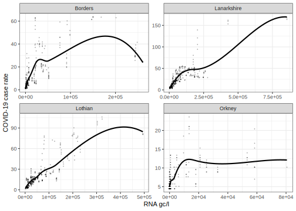<!-- -->

Now all of them

``` r
allscot %>% 
  ggplot(aes(N1,rollper)) + geom_point(alpha=0.25,size=0.25) +
  ylab("COVID-19 case rate") + xlab("RNA gc/l") +
  facet_wrap(~ hab, scales = "free") +
  geom_smooth(se=FALSE,color='black') +
  scale_x_continuous(labels = scales::scientific) +
  theme(axis.text.x = element_text(angle = 30,hjust=1))
```

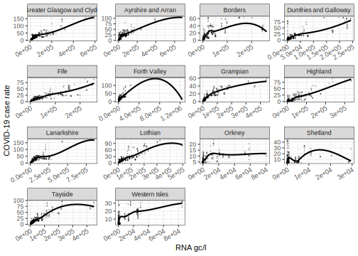<!-- -->

# Varying Coefficient models

Assemble data

``` r
scotplus = allscot %>% 
  filter(between(Date, as.Date("2020-09-01"),as.Date("2021-08-31"))) %>% 
  mutate(y = log10(rollper),
         x = log10(N1 + 20),
         timet = as.numeric(Date)-18505,
         hab = factor(hab))
```

Fit a model where each HAB has its own time varying intercept but the
slope is in common for all
*y* = *α*<sub>*i*</sub>(*t*) + *β*(*t*)*x*

``` r
gmod = gam(y ~ s(timet,by=hab) + s(timet,by=x), data=scotplus)
summary(gmod)
```


    Family: gaussian 
    Link function: identity 

    Formula:
    y ~ s(timet, by = hab) + s(timet, by = x)

    Parametric coefficients:
                Estimate Std. Error t value Pr(>|t|)
    (Intercept)   0.5070     0.0135    37.4   <2e-16

    Approximate significance of smooth terms:
                                            edf Ref.df     F p-value
    s(timet):habGreater Glasgow and Clyde  9.00   9.00  20.4  <2e-16
    s(timet):habAyrshire and Arran         9.00   9.00  25.8  <2e-16
    s(timet):habBorders                    9.00   9.00  36.7  <2e-16
    s(timet):habDumfries and Galloway      9.00   9.00  51.2  <2e-16
    s(timet):habFife                       9.00   9.00  25.9  <2e-16
    s(timet):habForth Valley               9.00   9.00  27.8  <2e-16
    s(timet):habGrampian                   9.00   9.00  31.4  <2e-16
    s(timet):habHighland                   8.99   9.00  32.7  <2e-16
    s(timet):habLanarkshire                8.99   9.00  25.2  <2e-16
    s(timet):habLothian                    8.95   9.00  19.3  <2e-16
    s(timet):habOrkney                     9.00   9.00  18.6  <2e-16
    s(timet):habShetland                   8.98   9.00  28.9  <2e-16
    s(timet):habTayside                    8.86   8.99  23.4  <2e-16
    s(timet):habWestern Isles              9.00   9.00  31.7  <2e-16
    s(timet):x                            10.00  10.00 274.3  <2e-16

    R-sq.(adj) =  0.811   Deviance explained = 81.6%
    GCV = 0.03523  Scale est. = 0.034288  n = 5110

Plot the coefficient functions, gray lines at Jan1, Apr1 and Jul1

``` r
par(mgp=c(1.5,0.5,0), mar=c(3.1,3.1,3.1,0), pch=20, mfrow=c(2,2))
for(i in 1:4){
  pgam = plot(gmod, rug=FALSE, xlab="Time", ylab='a(t)',
       main=allhabs[i], select=i)
  abline(v=c(90,180,270)+30,col=gray(0.75))
}
```

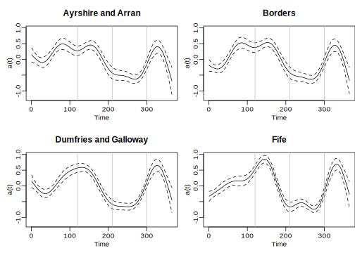<!-- -->

``` r
for(i in 5:8){
  plot(gmod, rug=FALSE, xlab="Time", ylab='a(t)',
       main=allhabs[i], select=i)
  abline(v=c(90,180,270)+30,col=gray(0.75))
}
```

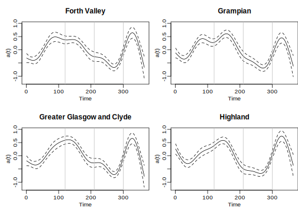<!-- -->

``` r
for(i in 9:12){
  plot(gmod, rug=FALSE, xlab="Time", ylab='a(t)',
       main=allhabs[i], select=i)
  abline(v=c(90,180,270)+30,col=gray(0.75))
}
```

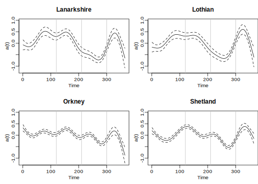<!-- -->

``` r
par(mfrow=c(1,2))
for(i in 13:14){
  plot(gmod, rug=FALSE, xlab="Time", ylab='a(t)',
       main=allhabs[i], select=i)
  abline(v=c(90,180,270)+30,col=gray(0.75))
}
```

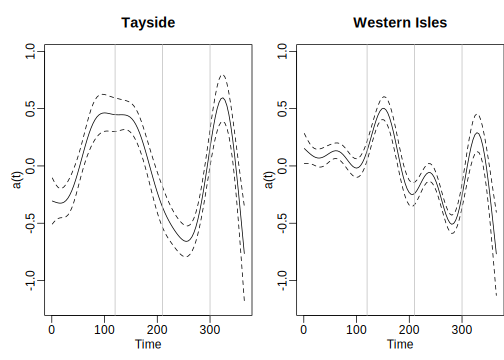<!-- -->

``` r
par(mfrow=c(1,1))
```

-   Most HABs have a similar shape
-   Number of WWTPs sampled increased from around 30 to 90 early in 2021

``` r
plot(gmod, rug=FALSE, xlab="Time", ylab='b(t)',
     select=15,scale=0)
abline(v=c(90,180,270)+30,col=gray(0.75))
```

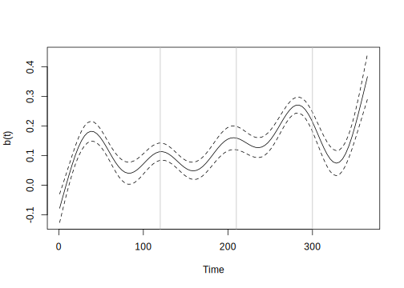<!-- -->

Improvement on slope over time but not reaching the desired target of
one. Maybe lab procedures are improving

Generate nicer plots

``` r
pgam = plot(gmod, pages = 1)
```

``` r
pgdf = data.frame(x=unlist(map(pgam,"x")),
                  fit=unlist(map(pgam,"fit")),
                  se=unlist(map(pgam,"se")),
                  hab = rep(c(allhabs,"beta"),each=100))
pgdf$ub = pgdf$fit+2*pgdf$se
pgdf$lb = pgdf$fit-2*pgdf$se
```

``` r
pgdf %>% filter(hab %in% allhabs[1:4]) %>% 
  ggplot(aes(x=x)) + 
  geom_ribbon(aes(ymin = lb, ymax = ub),fill="gray90") +
  geom_line(aes(y=fit)) +
  facet_wrap(~ hab) +
  ylab("a(t)") +
  scale_x_continuous(name="Date",breaks=c(90,180,270),
                     labels=c("Jan1","Apr1","Jul1"))
```

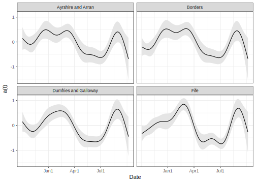<!-- -->

``` r
pgdf %>% filter(hab == "beta") %>% 
  ggplot(aes(x=x)) + 
  geom_ribbon(aes(ymin = lb, ymax = ub),fill="gray90") +
  geom_line(aes(y=fit)) +
  ylab("b(t)") +
  scale_x_continuous(name="Date",breaks=c(90,180,270),
                     labels=c("Jan1","Apr1","Jul1"))
```

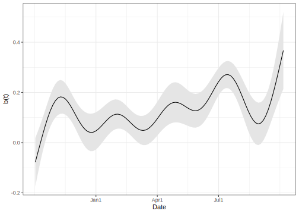<!-- -->

``` r
scotrna %>% mutate(Mon = floor_date(Date, "month")) %>% 
  group_by(Mon) %>% count() %>% 
  ggplot(aes(Mon,n)) + geom_step() +
  xlab("Date") + ylab("Samples per Month")
```

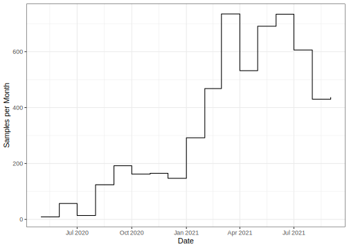<!-- -->

# Lagged Models for Prediction

Can we predict the future? Try lagging the N1 variable:

``` r
timewindow = 7
ldf = tibble(lag = 0:timewindow, r2 = rep(NA, timewindow+1),
             se = rep(NA,timewindow+1))

for(i in 0:timewindow){
  allscot %>% group_by(hab) %>% mutate(N1lag = lag(N1,i)) %>% ungroup() -> scotlag
  lmodlag = lm(log(rollper) ~ log(N1lag+20)*hab, scotlag)
  gd = glance(lmodlag)
  ldf$r2[i+1] = gd$r.squared
  ldf$se[i+1] = gd$sigma
}

ldf %>% knitr::kable(digits = 3)
```

| lag |    r2 |    se |
|----:|------:|------:|
|   0 | 0.715 | 0.526 |
|   1 | 0.702 | 0.536 |
|   2 | 0.687 | 0.548 |
|   3 | 0.671 | 0.561 |
|   4 | 0.653 | 0.575 |
|   5 | 0.634 | 0.589 |
|   6 | 0.615 | 0.603 |
|   7 | 0.596 | 0.617 |

We can see that the fit of the model decreases as the lag is increased
while the standard error increases. While we might obtain better
predictions by using more than one lagged variable, this does not
indicate any strong precognitive ability for N1.

Consider trying to predict a week ahead:

``` r
allscot %>% group_by(hab) %>% mutate(rollperlag = lag(rollper,7)) %>% 
  ungroup() -> scotlag
lmodlag7 = lm(log(rollper) ~ log(rollperlag)*hab, scotlag)
glance(lmodlag7)[c('r.squared','sigma')]
```

    # A tibble: 1 × 2
      r.squared sigma
          <dbl> <dbl>
    1     0.845 0.383

This model predicts a week ahead using current cases. We can see this
works better than using N1. Now suppose we have the current N1 count and
we add this information to the model:

``` r
allscot %>% group_by(hab) %>% 
  mutate(rollperlag = lag(rollper,7),
         N1lag7 = lag(N1,7)) %>% 
  ungroup() -> scotlag
lmodlagcase7 = lm(log(rollper) ~ (log(rollperlag) + log(N1lag7+20))*hab, scotlag)
glance(lmodlagcase7)[c('r.squared','sigma')]
```

    # A tibble: 1 × 2
      r.squared sigma
          <dbl> <dbl>
    1     0.851 0.375

We can see this is only fractionally better than using cases alone i.e
N1
