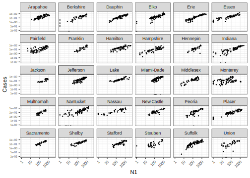
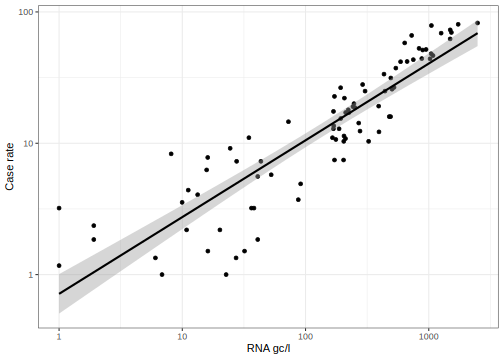
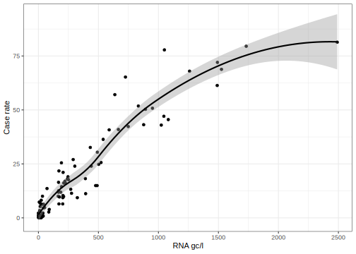
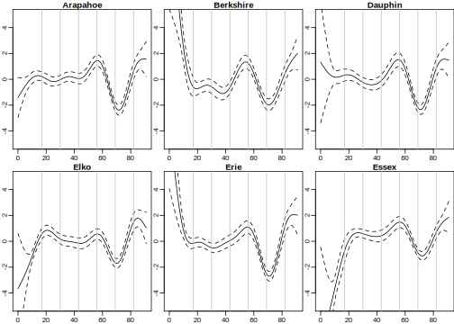
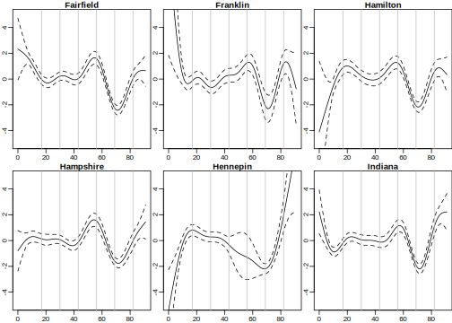
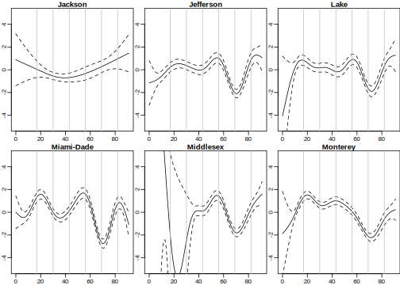
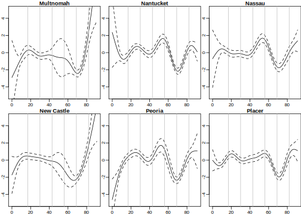
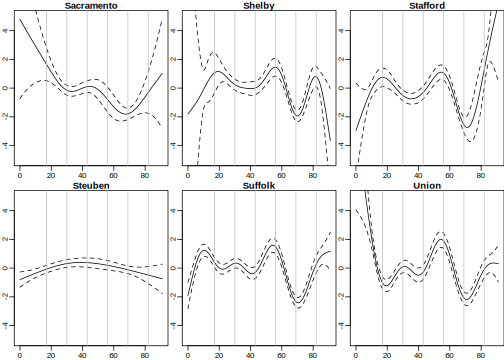
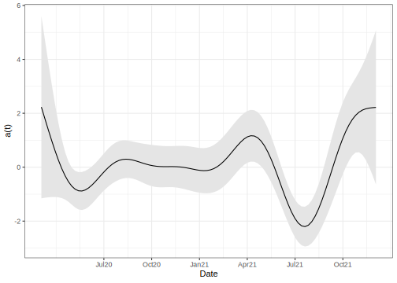
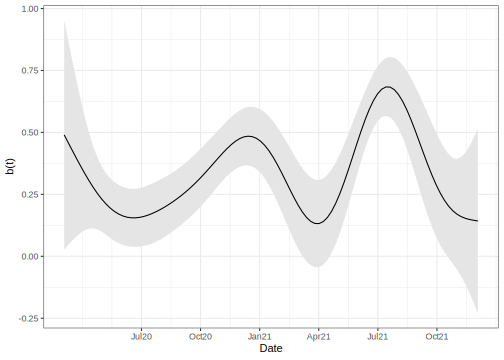

US RNA and Covid case modelling
================
Julian Faraway
2022-01-06

# Setup

``` r
library(svglite)
library(here)
library(dplyr)
library(ggplot2)
library(purrr)
library(lubridate)
library(mgcv)
library(broom)

load(here("data/usa.rda"))
```

Plot of all counties

``` r
usa %>% ggplot(aes(N1+1,cases)) + 
  geom_point(size=0.5) +
  scale_x_continuous(name="N1",trans="log10") +
  scale_y_continuous(name= "Cases", trans="log10") +
  facet_wrap(~ county) +
  theme(axis.text.x = element_text(angle = 45, hjust = 1, size = 8),
        axis.text.y = element_text(size = 6))
```

<!-- -->

Correlations between N1 and incidence

``` r
usa %>% 
  group_by(county) %>% 
  summarise(incidence = cor(log(N1+1),log(cases+1),use = "complete.obs")) %>% 
  knitr::kable(digits=3)
```

| county     | incidence |
|:-----------|----------:|
| Arapahoe   |     0.800 |
| Berkshire  |     0.886 |
| Dauphin    |     0.917 |
| Elko       |     0.885 |
| Erie       |     0.944 |
| Essex      |     0.908 |
| Fairfield  |     0.714 |
| Franklin   |     0.890 |
| Hamilton   |     0.758 |
| Hampshire  |     0.846 |
| Hennepin   |     0.763 |
| Indiana    |     0.888 |
| Jackson    |     0.832 |
| Jefferson  |     0.828 |
| Lake       |     0.852 |
| Miami-Dade |     0.618 |
| Middlesex  |     0.872 |
| Monterey   |     0.394 |
| Multnomah  |     0.865 |
| Nantucket  |     0.811 |
| Nassau     |     0.887 |
| New Castle |     0.766 |
| Peoria     |     0.801 |
| Placer     |     0.907 |
| Sacramento |     0.930 |
| Shelby     |     0.885 |
| Stafford   |     0.800 |
| Steuben    |     0.776 |
| Suffolk    |     0.875 |
| Union      |     0.730 |

Indiana county as seen in the paper

``` r
ssite = "Indiana"
```

``` r
usa %>% filter(county == ssite) %>% 
  ggplot(aes(N1+1,cases+1)) + geom_point() + 
  geom_smooth(method="lm",color='black') +
  xlab("RNA gc/l") + ylab("Case rate") +
  scale_y_log10() + scale_x_log10() 
```

<!-- -->

``` r
usa %>% filter(county == ssite) %>% 
  ggplot(aes(N1,cases)) + geom_point() + 
  geom_smooth(color='black') +
  xlab("RNA gc/l") + ylab("Case rate") 
```

<!-- -->

# Models

Linear fit in each county on log scales

Need +1 for zero values

``` r
lmodpop = lm(log(cases+1) ~ log(N1 + 1) * county, usa)
anova(lmodpop)
```

    Analysis of Variance Table

    Response: log(cases + 1)
                         Df Sum Sq Mean Sq F value Pr(>F)
    log(N1 + 1)           1   1141    1141 3313.36 <2e-16
    county               29    145       5   14.52 <2e-16
    log(N1 + 1):county   29     77       3    7.71 <2e-16
    Residuals          1770    609       0               

``` r
summary(lmodpop)
```


    Call:
    lm(formula = log(cases + 1) ~ log(N1 + 1) * county, data = usa)

    Residuals:
       Min     1Q Median     3Q    Max 
    -3.990 -0.296  0.058  0.351  2.323 

    Coefficients:
                                  Estimate Std. Error t value Pr(>|t|)
    (Intercept)                  -0.077046   0.323772   -0.24  0.81194
    log(N1 + 1)                   0.592698   0.063620    9.32  < 2e-16
    countyBerkshire               0.051980   0.404536    0.13  0.89777
    countyDauphin                -0.923651   0.453149   -2.04  0.04167
    countyElko                   -0.123736   0.395868   -0.31  0.75465
    countyErie                   -1.232861   0.411549   -3.00  0.00278
    countyEssex                   1.152843   0.360994    3.19  0.00143
    countyFairfield               0.297945   0.399179    0.75  0.45553
    countyFranklin               -2.339375   0.708846   -3.30  0.00099
    countyHamilton                0.243637   0.472592    0.52  0.60624
    countyHampshire               0.099549   0.390690    0.25  0.79891
    countyHennepin               -1.151158   0.588428   -1.96  0.05058
    countyIndiana                -0.260582   0.371997   -0.70  0.48371
    countyJackson                -1.423197   0.923196   -1.54  0.12335
    countyJefferson              -1.320227   0.501756   -2.63  0.00858
    countyLake                    0.256116   0.495211    0.52  0.60509
    countyMiami-Dade             -1.489844   0.539579   -2.76  0.00582
    countyMiddlesex              -0.176230   0.434482   -0.41  0.68508
    countyMonterey                1.695227   0.355187    4.77    2e-06
    countyMultnomah              -2.113763   0.747049   -2.83  0.00471
    countyNantucket               0.109611   0.369613    0.30  0.76684
    countyNassau                  1.244345   0.370729    3.36  0.00081
    countyNew Castle             -0.265214   0.524090   -0.51  0.61289
    countyPeoria                 -1.738834   0.507622   -3.43  0.00063
    countyPlacer                  0.241118   0.366005    0.66  0.51012
    countySacramento             -1.224135   0.677558   -1.81  0.07098
    countyShelby                 -0.154421   0.528347   -0.29  0.77011
    countyStafford               -1.060720   0.567356   -1.87  0.06171
    countySteuben                -0.096502   0.426880   -0.23  0.82118
    countySuffolk                -0.776878   0.419946   -1.85  0.06449
    countyUnion                  -0.496597   0.453986   -1.09  0.27417
    log(N1 + 1):countyBerkshire  -0.033054   0.080008   -0.41  0.67956
    log(N1 + 1):countyDauphin     0.091221   0.084479    1.08  0.28038
    log(N1 + 1):countyElko        0.037133   0.077037    0.48  0.62985
    log(N1 + 1):countyErie        0.171256   0.079466    2.16  0.03129
    log(N1 + 1):countyEssex      -0.123663   0.073324   -1.69  0.09187
    log(N1 + 1):countyFairfield  -0.084923   0.079095   -1.07  0.28311
    log(N1 + 1):countyFranklin    0.349172   0.128089    2.73  0.00647
    log(N1 + 1):countyHamilton   -0.083750   0.087079   -0.96  0.33630
    log(N1 + 1):countyHampshire  -0.086753   0.078212   -1.11  0.26749
    log(N1 + 1):countyHennepin    0.183659   0.114557    1.60  0.10907
    log(N1 + 1):countyIndiana    -0.008132   0.072636   -0.11  0.91087
    log(N1 + 1):countyJackson     0.129514   0.161465    0.80  0.42259
    log(N1 + 1):countyJefferson   0.235530   0.095873    2.46  0.01412
    log(N1 + 1):countyLake       -0.069151   0.093074   -0.74  0.45760
    log(N1 + 1):countyMiami-Dade  0.321494   0.102826    3.13  0.00180
    log(N1 + 1):countyMiddlesex   0.088381   0.089574    0.99  0.32394
    log(N1 + 1):countyMonterey   -0.353810   0.074113   -4.77    2e-06
    log(N1 + 1):countyMultnomah   0.327671   0.152354    2.15  0.03163
    log(N1 + 1):countyNantucket  -0.000455   0.073163   -0.01  0.99504
    log(N1 + 1):countyNassau     -0.163874   0.073873   -2.22  0.02666
    log(N1 + 1):countyNew Castle  0.019295   0.104480    0.18  0.85351
    log(N1 + 1):countyPeoria      0.271617   0.097539    2.78  0.00541
    log(N1 + 1):countyPlacer     -0.104051   0.072721   -1.43  0.15266
    log(N1 + 1):countySacramento  0.241562   0.132471    1.82  0.06840
    log(N1 + 1):countyShelby      0.055683   0.102746    0.54  0.58792
    log(N1 + 1):countyStafford    0.100252   0.105375    0.95  0.34154
    log(N1 + 1):countySteuben     0.010230   0.087009    0.12  0.90642
    log(N1 + 1):countySuffolk     0.115923   0.081696    1.42  0.15609
    log(N1 + 1):countyUnion       0.083457   0.093938    0.89  0.37443

    Residual standard error: 0.587 on 1770 degrees of freedom
      (72 observations deleted due to missingness)
    Multiple R-squared:  0.691, Adjusted R-squared:  0.681 
    F-statistic: 67.1 on 59 and 1770 DF,  p-value: <2e-16

-   Intercepts vary greatly by county (more so than in Scotland)
    indicating large heterogeneity in sewage systems
-   Slopes are less than one (sometimes substantially) which shows the
    same less than linear (on the original scale) behaviour as also seen
    in the Scotland data

# Time Varying Models

Create a week number for the time index

Date start on

``` r
min(usa$date)
```

    [1] "2020-03-04"

``` r
usa %>% 
  mutate(timet = (as.numeric(date) - as.numeric(min(usa$date)))/7,
         y = log(cases+1),
         x = log(N1+1),
         county = factor(county)) -> usa
```

Fit the model

``` r
gmod = gam(y ~ s(timet,by=county) + s(timet,by=x), data=usa)
summary(gmod)
```


    Family: gaussian 
    Link function: identity 

    Formula:
    y ~ s(timet, by = county) + s(timet, by = x)

    Parametric coefficients:
                Estimate Std. Error t value Pr(>|t|)
    (Intercept)   1.0828     0.0795    13.6   <2e-16

    Approximate significance of smooth terms:
                                edf Ref.df      F p-value
    s(timet):countyArapahoe    9.00   9.00  19.39 < 2e-16
    s(timet):countyBerkshire   8.72   8.94  13.96 < 2e-16
    s(timet):countyDauphin     9.00   9.00  20.80 < 2e-16
    s(timet):countyElko        9.00   9.00  15.73 < 2e-16
    s(timet):countyErie        9.00   9.00  25.88 < 2e-16
    s(timet):countyEssex       7.91   8.25  21.22 < 2e-16
    s(timet):countyFairfield   9.00   9.00  28.94 < 2e-16
    s(timet):countyFranklin    8.92   8.99   3.95 5.5e-05
    s(timet):countyHamilton    8.80   8.97  17.33 < 2e-16
    s(timet):countyHampshire   8.99   9.00  15.18 < 2e-16
    s(timet):countyHennepin    7.39   8.08  20.27 < 2e-16
    s(timet):countyIndiana     9.00   9.00  19.47 < 2e-16
    s(timet):countyJackson     2.13   2.45   7.47 0.00026
    s(timet):countyJefferson   9.00   9.00  16.97 < 2e-16
    s(timet):countyLake        8.82   8.98  10.50 < 2e-16
    s(timet):countyMiami-Dade  9.00   9.00  31.71 < 2e-16
    s(timet):countyMiddlesex   7.69   7.91  19.16 < 2e-16
    s(timet):countyMonterey    8.55   8.90  32.20 < 2e-16
    s(timet):countyMultnomah   7.03   7.74  23.08 < 2e-16
    s(timet):countyNantucket   9.00   9.00  21.65 < 2e-16
    s(timet):countyNassau      8.69   8.95  10.57 < 2e-16
    s(timet):countyNew Castle  7.00   7.69  17.62 < 2e-16
    s(timet):countyPeoria      8.79   8.98  22.63 < 2e-16
    s(timet):countyPlacer      9.00   9.00  13.92 < 2e-16
    s(timet):countySacramento  4.91   5.64  16.63 < 2e-16
    s(timet):countyShelby      8.14   8.49  13.59 < 2e-16
    s(timet):countyStafford    7.85   8.32  17.59 < 2e-16
    s(timet):countySteuben     2.01   2.38   4.96 0.00286
    s(timet):countySuffolk     9.00   9.00  28.87 < 2e-16
    s(timet):countyUnion       8.70   8.95  20.89 < 2e-16
    s(timet):x                10.00  10.00 112.10 < 2e-16

    R-sq.(adj) =  0.847   Deviance explained = 86.8%
    GCV = 0.19073  Scale est. = 0.16456   n = 1830

First plot the intercept coefficient function *α*<sub>*i*</sub>(*t*).
Grey vertical lines represent quarters (start Jul20, Oct20, Jan21,
Apr21, Jul21, Oct21)

``` r
allcounties = levels(usa$county)
par(mgp=c(1.5,0.5,0), mar=c(1.5,1.5,1.1,0), pch=20, mfrow=c(2,3))
for(i in 1:6){
  plot(gmod, rug=FALSE, xlab="", ylab="",
       main=allcounties[i], select=i,ylim=c(-5,5))
  abline(v=c(17,30,43,56,69, 82),col=gray(0.75))
}
```

<!-- -->

``` r
for(i in 7:12){
  plot(gmod, rug=FALSE, xlab="", ylab="",
       main=allcounties[i], select=i,ylim=c(-5,5))
  abline(v=c(17,30,43,56,69,82),col=gray(0.75))
}
```

<!-- -->

``` r
for(i in 13:18){
  plot(gmod, rug=FALSE, xlab="", ylab="",
       main=allcounties[i], select=i,ylim=c(-5,5))
  abline(v=c(17,30,43,56,69, 82),col=gray(0.75))
}
```

<!-- -->

``` r
for(i in 19:24){
  plot(gmod, rug=FALSE, xlab="", ylab="",
       main=allcounties[i], select=i,ylim=c(-5,5))
  abline(v=c(17,30,43,56,69,82),col=gray(0.75))
}
```

<!-- -->

``` r
for(i in 25:30){
  plot(gmod, rug=FALSE, xlab="", ylab="",
       main=allcounties[i], select=i,ylim=c(-5,5))
  abline(v=c(17,30,43,56,69, 82),col=gray(0.75))
}
```

<!-- -->

``` r
par(mfrow=c(1,1))
```

-   Some counties have missing data, particularly at the beginning of
    the period which leads to greater uncertainty (wide bands)

Nicer plots for publication

``` r
pgam = plot(gmod)
```

``` r
pgdf = data.frame(x=unlist(map(pgam,"x")),
                  fit=unlist(map(pgam,"fit")),
                  se=unlist(map(pgam,"se")),
                  county = rep(c(allcounties,"beta"),each=100))
pgdf$ub = pgdf$fit+2*pgdf$se
pgdf$lb = pgdf$fit-2*pgdf$se
```

``` r
pgdf %>% filter(county == ssite) %>% 
  ggplot(aes(x=x)) + 
  geom_ribbon(aes(ymin = lb, ymax = ub),fill="gray90") +
  geom_line(aes(y=fit)) +
  ylab("a(t)") +
  scale_x_continuous(name="Date",
                     breaks=c(17,30,43,56,69,82),
                     labels=c("Jul20", "Oct20", "Jan21", "Apr21", 
                              "Jul21", "Oct21"))
```

<!-- -->

``` r
pgdf %>% filter(county == "beta") %>% 
  ggplot(aes(x=x)) + 
  geom_ribbon(aes(ymin = lb, ymax = ub),fill="gray90") +
  geom_line(aes(y=fit)) +
  ylab("b(t)") +
  scale_x_continuous(name="Date",
                     breaks=c(17,30,43,56,69,82),
                     labels=c("Jul20", "Oct20", "Jan21", "Apr21", 
                              "Jul21", "Oct21"))
```

<!-- -->

# Lagged Models for Prediction

Can we predict the future? Fit the concurrent model

``` r
lmodpop = lm(log(cases+1) ~ log(N1 + 1) * county, usa)
glance(lmodpop)[c('sigma','adj.r.squared')]
```

    # A tibble: 1 × 2
      sigma adj.r.squared
      <dbl>         <dbl>
    1 0.587         0.681

Try lagging the N1 variable by one week

``` r
lmodlag1 = lm(log(cases+1) ~ lag(log(N1 + 1),1) * county, usa)
glance(lmodlag1)[c('sigma','adj.r.squared')]
```

    # A tibble: 1 × 2
      sigma adj.r.squared
      <dbl>         <dbl>
    1 0.755         0.470

Worse than the concurrent model

Now suppose we use case data to predict one week ahead:

``` r
lmodnoww = lm(log(cases+1) ~ lag(log(cases + 1),1) * county, usa)
glance(lmodnoww)[c('sigma','adj.r.squared')]
```

    # A tibble: 1 × 2
      sigma adj.r.squared
      <dbl>         <dbl>
    1 0.685         0.597

Works better than using WW even though it is a very simplistic model

``` r
lmodboth = lm(log(cases+1) ~ lag(log(cases + 1),1) + lag(log(N1+1),1) * county, usa)
glance(lmodboth)[c('sigma','adj.r.squared')]
```

    # A tibble: 1 × 2
      sigma adj.r.squared
      <dbl>         <dbl>
    1 0.671         0.580

Adding WW info results in no improvement to the predictive ability of
the model
